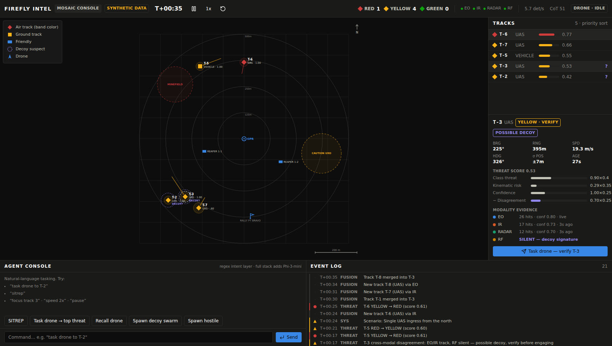
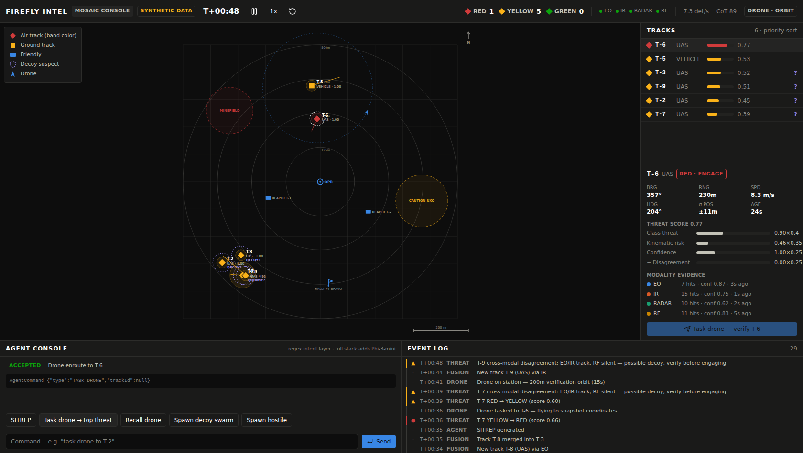

# Firefly Intel — MOSAIC Operator Console

**A browser-only demonstration of on-device tactical fusion for the dismounted operator.**

> **Demonstration prototype.** Everything here is synthetic and runs entirely in your browser — no backend, no real sensors, no real platforms. The console is a decision-support demo: it controls nothing and takes no autonomous action. This project is not an official product of, and is not endorsed by, the U.S. Army, USACE, ERDC, the Department of Defense, or the U.S. Government.


*Cross-modal disagreement in action: EO and IR confirm the southwest contacts, RF is silent — the console flags them as possible decoys and pins them at YELLOW · VERIFY. The one genuinely RF-emitting hostile is RED.*

## What this is

Firefly Intel's full MOSAIC stack is a five-process system (FastAPI backend, synthetic feed, Phi-3-mini agent shim via Ollama, faster-whisper STT, TAK/CoT emitter). This repository is the **single-screen operator console**, implemented as a self-contained React + TypeScript app with the fusion pipeline ported to the browser so the whole detect → classify → task drone → confirm → decide loop can be demonstrated with zero setup beyond `npm install`.

The simulation implements the same math the full stack documents:

- **Synthetic multi-sensor feed** — EO, IR, RADAR, RF detections at ~8/s with per-modality noise, confidence, and misclassification rates. Decoys present to EO/IR, weakly to RADAR, and never to RF.
- **Track fusion** — 3-sigma association gate with a motion-aware spatial floor, inverse-variance position fusion, log-odds Bayesian confidence weighted by per-modality reliability priors, anchored velocity estimation, and track-to-track merging of duplicates.
- **Threat scoring** — weighted sum of classification threat, kinematic risk relative to the operator, and fused confidence, minus a **cross-modal disagreement penalty** (EO+IR present, RF silent: the canonical decoy signature). Bands: RED (engage-priority cue), YELLOW (verify), GREEN (clear). A suspected decoy is pinned at YELLOW until verified; brand-new RF-silent tracks hold at YELLOW until RF correlation has had a chance to run.
- **Drone verification state machine** (4 Hz) — IDLE → ENROUTE (snapshot coordinates) → ORBIT (200 m ring, 15 s) → RESOLVE (RED if confirmed hostile, GREEN if confirmed decoy) → RTB. Resolution is scripted from scenario ground truth, exactly as in the full stack's demo mode.
- **Agent console** — the deterministic regex intent layer of the MOSAIC agent shim (the full stack adds Phi-3-mini via Ollama). Free text like *"task drone to T-2"* becomes a structured `AgentCommand`, validated in three layers (intent → schema → state), with rejections explained. Includes a deterministic SITREP generator.
- **Scripted scenario** — a decoy group draws attention from the southwest; the real swarm arrives later from the opposite vector. Demo controls let you spawn more decoys or hostiles at will.

Every step is visible on one screen: status bar (mission clock, band counts, sensor health, CoT counter), tactical map (range rings, MIL-STD-inspired shape coding, confidence rings, drone animation), priority-sorted track list with per-modality evidence and score breakdown, event log, and the agent console.


*A verification pass in progress: the drone orbits the tasked contact while the track panel shows the full score breakdown.*

## Quick start

Prerequisites: Node 20+.

```bash
npm install
npm run dev        # http://localhost:3000
```

**Verify it worked:** within a few seconds the map shows the operator marker and friendly units; by T+00:10 threat tracks appear; by T+00:30 the southwest cluster carries violet **DECOY?** flags. Click a track, press **Task drone — verify**, and watch the drone fly out, orbit, and resolve the band.

Things to try in the agent console:

```
task drone to T-3
sitrep
focus track 2 · speed 2x · pause
spawn decoy swarm
```

## Development

```bash
npm run lint       # ESLint
npm run typecheck  # tsc, strict
npm test           # vitest — fusion, threat, drone, commands, engine integration
npm run build      # production build
```

CI runs all four on every push (`.github/workflows/ci.yml`). The simulation is seeded and deterministic: the engine never calls `Math.random`, so demo runs are reproducible.

## Project structure

```
src/
  sim/            # engine: scenario, sensors, fusion, threat, drone, commands, sitrep
  sim/__tests__/  # unit + integration tests for the pipeline
  sections/       # StatusBar, TacticalMap, TrackPanel, EventLog, CommandConsole
  components/ui/  # minimal UI primitives
  hooks/          # useSimulation (engine ownership + rAF loop)
  types/          # canonical domain types
docs/             # screenshots
```

## Honest limitations

- All data is synthetic; the drone's confirm/deny is scripted from scenario ground truth, not perception.
- The RF-silence decoy heuristic has a known false-negative mode (fiber-guided or waypoint-only threats are RF-silent too) — the console treats the flag as a *verify* cue, never an engage cue, and holds rather than suppresses RED for aged RF-silent tracks.
- The browser console is a demo surrogate for the full stack's TAK integration; the CoT counter simulates emission cadence only.

## Related documents

| File | Contents |
|------|----------|
| `MOSAIC_README_IMPROVED.md` | Rewritten README for the full Firefly-MOSAIC stack (drop-in) |
| `MOSAIC_README_ANALYSIS.md` | Why the original README was rewritten — findings by severity |

## License

MIT — see `LICENSE`. All data in this repository is synthetic; it contains no real sensor data and no controlled information.
